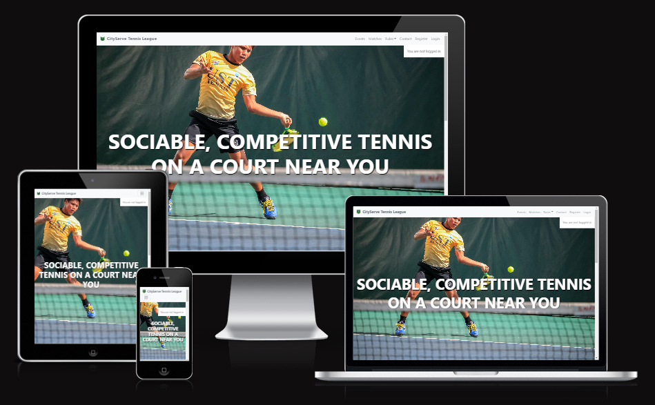

# CityServe Tennis League

CityServe Tennis League offers a delightful blend of friendly, social, and competitive tennis for enthusiasts of all skill levels. It's not just about the game; it's also about fostering a sense of community and camaraderie among its members. Whether you're a seasoned player looking for some challenging matches or a beginner seeking a welcoming environment to improve your skills, CityServe Tennis League has something for everyone. Joining this league is a great way to stay active, make new friends, and enjoy the thrill of tennis in a supportive setting.

The link to the live website can be found [here](https://city-serve-f48d9e79e0a9.herokuapp.com/).

Admin login credentials are as follows: 
- Username: CityServe
- Password: Server39410

## Table of contents

+ [UX](#ux "UX")
    + [Site Purpose](#site-purpose "Site Purpose")
    + [Site Goals](#site-goal "Site Goal")
    + [Target Audience](#target-audience "Target Audience")
    + [Navigation](#navigation "Navigation")
    + [Current User Goals](#current-user-goals "Current User Goals")
    + [New User Goals](#new-user-goals "New User Goals")
+ [User Stories](#user-stories "user-stories")
    + [Admin Stories](#admin-stories "Admin Stories")
    + [Members Stories](#members-stories "Members Stories")
    + [Visitor Stories](#visitor-stories "Visitor Stories")
+ [Design](#design "Design")
    + [Typography](#typography "Typography")
    + [Colour Choices](#colour-choices "Colour Choices")
+ [Features](#features "Features")
    + [Existing Features](#existing-features "Existing Features")
    + [C.R.U.D Operations](#crud-operations "C.R.U.D Operations")
+ [Testing](#testing "Testing")
    + [Validator Testing](#validator-testing "Validator Testing")
    + [General Continuous Testing](#general-continuous-testing "General Continuous Testing")
    + [De-Bugging](#de-bugging "De-Bugging")
+ [Technologies Used](#technologies-used "Technologies Used")
    + [Frameworks, Libraries and Programs](#frameworks-libraries-and-programs "Frameworks, Libraries and Programs")
    + [Languages](#languages "Languages")
+ [Deployment](#deployment "Deployment")
+ [Credits](#credits "Credits")
    + [Inspired Works](#inspired-works "Inspired Works")
    + [Media](#media "Media")

## User Experience (UX)
### Site Purpose:
The intended use and purpose of CityServe Tennis League is to create tennis for anyone, regardless of ability, age or experience. It is a place where players can come together to form events, competitions or just organise a game of social tennis, but make it accessable to everyone. Creating an event is done with ease and is published straight to the site, where other players can see all of the information given for the event; such as time, location, date, description and the user who created it. Theres is also a comments area where users can give their feedback on events and share their experiences of CityServe, and help the platform to become the best around. Members can also log into their members area and join events directly to let the organisers know they will be there for definite. 

### Site Goals:
CityServe was built to try and encourage Tennis to be played within the local community. The hope is, that it will bring people closer together, to not only have fun playing sport, but potentially bring opportunities that are beneficial and inspiring within our group of players. We've built a space where players can create events, comment and feedback on upcoming events but also support one another by attending and signing up for those events that people have created and shared.

### Target Audience:
The target audience is anyone and everyone, tennis is a hugely inclusive sport that is scientifically proven to be a "lifetime sport" and improve your cardiovascular health (NIH.gov). CityServe caters to all ages, abilities and experience, as it is run by our dedicated team as well as you, the player. Players and staff will organise events throughout the year, so there is always something to do!

### Navigation:
The navigation throughout the website is simple, due to clear navigation at the top of the website. The Home Page gives the user or visitor information on what we offer as well as testemonials to show people the experiences of others.

### Current User Goals:
Our current goals are for tennis players to have better access to more opportunities to play tennis locally, in an environment they know they can have fun in. It is made by the community, for the community.

### New User Goals:
As a new visitor to the site, our goal is to show what we offer, and to give real insights from current players about CityServe. We want people to see that it is a fun and encouraging environment whereby they are welcomed to join any event we have on offer.

## User Stories
### Admin Stories:
...

### Member Stories:
...

### Visitor Stories:
...

## Design
### Typography:
The fonts for the website are all chosen from the range within the Google Fonts Library. The current fonts used within the website are
- Klee One: Site/page headings or titles.

### Colour Choices:

*image of colours used*

## Features
### Existing Features:

#### Navigation Bar:

Desktop view:

Mobile view:

#### Rules Page:

#### Events Page:

#### Event Details:

#### Login Page, Logout and Sign Up Pages:

Login:

Logout:

Sign Up:

#### Footer

### Future Features: *Basic HTML was created for some of these pages but could not be properly implemented in time for the websites release/submision.*

#### Home Page (Landing Page):

#### Leagues Page:

#### Contact Page:

#### Comment Form for Events Page:

On the Events page, I would like the users to be able to comment and sign up for events directly once they have interacted with them. Development of the comment form did take place but bugs occured before deployment due to text body field not appearing. A fix was tried but it resulted in users not being able to submit their comments and be stored.

### C.R.U.D Operations:

#### Create:
- The create button on our "Events" page is there for registered users to add events or social activities they are wanting to run as part of the tennis club.

## Testing
### Validator Testing:
...

### General Continuous Testing:
...

### De-Bugging:
- When creating a modal for the Login button, now popup was being shown. Re-reading the code line by line of the modal and the Login section made me realise that the data-bs-target was not correctly aligned with what it was trying to pull from and was resulting in no popup. Renaming it to match the modal code section finally allowed the modal to appear. 
- Upon creating a custom CSS file, I noticed that any styles that were being added, we not affecting the site. I re-wrote the link to the css file, ensuring it was correct but that didn't result in a fix. Browsing the internet for answers, I came across a comment that showed the order of which the CSS custom file and Bootstraps CSS file should be written in. I moved the custome CSS file below Bootstraps and it fixed the issue, allowing me to use custom CSS styles alongside.
- When resizing my screen to test compatiblity i noticed that the Navbar was not reacting accordingly and when at medium-small sizes, part of the end of it was missing from the screen. I tried adjusting the Bootstrap CSS but it didn't work. I went back through the Boostrap website guides for Navbars and realised I had incorrectly insert the container class and not made it fluid. Once added, the Navbar responded to the change in screen size and reacted how it was intended.
- When at full screen, the landing page image was not displaying correctly and was positioned so that the head of the player was missing from the screen. Upon reading through my code, I saw that the styling for the image was set to 'Center', and tried re-styling the image to be at the 'Bottom'. This fixed the issue and remained perfectly scaled for smaller devices also.
- When installing the Django files, I was met with numerous error messages stating my commands not being recognised within the terminal. With the assistance of a mentor i was able to rectify this problem by by selected a new default terminal 'command prompt'.
- During the Django installation I was met with another issue whereby my 'events' folder was not being recognised why trying to run a server and thus was resulting in a failed load. Running through my code i could see that URLPatterns path for the folder was writen okay, but i had forgotten to include the '*from events import views as events_views*'
- Resolved and issue within the database model where an error was occuring when trying to add a method to the Events model. I had opted to use 'user' to display the author of the post and had mismatched my mode when following along the creation guide. However, I was able to fix the issue by removing 'author' as an option and kept it as the user name for the post creator.
- The was an issue with migrations due to changes being made that affected a prior migration. To fix this, I was guided by the tutor team to delete the database and create a new one, then do makemigrations and migrate again. This fixed this issue and allowed futher migrations to happen.

### Current Bugs:
- When trying to add a comment form, the body field is not being displayed for logged in users to comment on events with.
- Navbar links don't correctly navigate users to the associated pages.
- Contact form is no longer synced to the website. It needs to be reconnected once a new page is created for it.

## Technologies Used
### Frameworks, Libraries and Programs

- Bootstrap 5
- GitHub
- Font Awesome
- Visual Studio Code
- Gitpod

### Languages

- HTML
- CSS
- JavaScript
- Python
- Django
- SQL

## Deployment

### Running the project locally
1. Go to [the project repository](https://github.com/AJMCoder/Project-4)
2. Click on the "Code" button.
3. Choose one of the three options (HTTPS, SSH or GitHub CLI) and then click copy.
4. Open the terminal in you IDE program. 
5. Type `git clone` and paste the URL that was copied in step 3.
6. Press Enter and the local clone will be created.

### Deploying with Heroku

1. Go to [Heroku.com](https://dashboard.heroku.com/apps) and log in; if you do not already have an account then you will need to create one.
2. Click the `New` dropdown and select `Create New App`.
3. Enter a name for your new project, all Heroku apps need to have a unique name, you will be prompted if you need to change it.
4. Select the region you are working in.

#### Heroku Settings  
You will need to set your Environment Variables - this is a key step to ensuring your application is deployed properly.
1. In the Settings tab, click on `Reveal Config Vars` and set the following variables:
    - Add key: `PORT` & value `8000`
    - Add key: DATABASE_URL, this should have been created automatically by Heroku.
    - Add key: CLOUDINARY_URL and the value as your cloudinary API Environment variable e.g.
    - Add key: SECRET_KEY and the value as a complex string which will be used to provide cryptographic signing.

2. Buildpacks are also required for proper deployment, simply click `Add buildpack` and search for the ones that you require.
    - For this project, I needed to add `Python`.

####  Heroku Deployment  
In the Deploy tab:
1. Connect your Heroku account to your Github Repository following these steps:
    - Click on the `Deploy` tab and choose `Github-Connect to Github`.
    - Enter the GitHub repository name and click on `Search`.
    - Choose the correct repository for your application and click on `Connect`.
2. You can then choose to deploy the project manually or automatically, automatic deployment will generate a new application every time you push a change to Github, whereas manual deployment requires you to push the `Deploy Branch` button whenever you want a change made.
3. Once you have chosen your deployment method and have clicked `Deploy Branch` your application will be built and you should now see the `View` button, click this to open your application.

## Credits
### Inspired Works:
- Inspiration taken from [Net Ninja](https://www.youtube.com/watch?v=yCCIztB-S_k&list=PL4cUxeGkcC9joIM91nLzd_qaH_AimmdAR&index=8).
- Responsive Font Size formula adapted from [Matthew James Taylor](https://matthewjamestaylor.com/  responsive-font-size#:~:text=To%20make%20font%20size%20responsive%20in%20steps%2C%20set%20the%20base,relative%20to%20the%20screen%20width.).
- Resources used from [Codecademy](https://www.codecademy.com/resources/docs), and Mimo Coding App. 

### Media:
- The images used for the Landing page was from [Pexels](https://www.pexels.com/).

### Acknowledgements
  - The tutor support team at Code Institute for their support.
  - My Code Institute Mentor for feedback and suggestions.
  - The Code Institute Slack community.