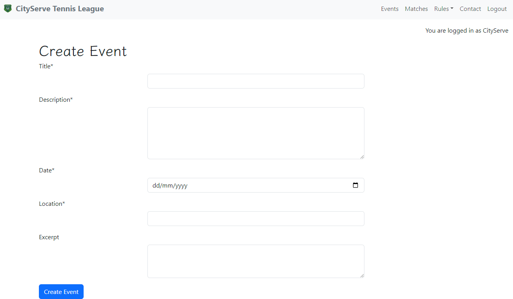

## Manual Testing

### When user is *Not logged in*

#### Every link was tested to ensure that it redirects to the appropriate url and functions as intended.

Navbar

Logo

Home page - When the user is logged out, you will see in the top right, a notification that states this.

Contact Us Button

Events page

Event detail page

Matches Page

Submit match result page

Rules page

Contact page

Registration page

Login page

#### Registration Page

Each instance of the registration page was tested to ensure the necessary warnings and signals were in place incase of the form being incomplete.

Registration with no information presented

Registration with no password entered

Registration with no repeat password entered

Registration with incorrect/insufficiently completed password

Registration link to sign-in page

#### Login Page

The login page was tested to ensure that different scenarios where accommodated for.

Login page with incorrect username or password

Login page with remembered user information

Login page with link to registration page

### When user is *Logged in*

#### Every link was tested to ensure that it redirects to the appropriate url and functions as intended now that the user is logged in.

Navbar

Home page - Now that the user is logged in, it tells them which account they are logged in with.

Events page

Event detail page

Event creation page

Event editting

Event deletion

Matches Page

Submit match result page

Submit match results with insufficient input

Rules page

Contact page

Logout page

#### Event creation process

Test event: The event is being written to test the publishing capabilities of the website.

Test event: Once created, the user is directed to the event details where they can change an details. However, if they leave this page, it cannot be editted until published fully on the site. This requires Admin approval.

Test event: Now that the event has been approved by an admin, it will appear on the events page.

#### Footer Links

All footer links open their respective websites in a new tab.

Facebook

Instagram

X *Twitter*

## Automated Testing

Django's automated testing is useful because it ensures the reliability and stability of applications by detecting bugs early in the development process. It helps prevent regressions when new features are added or code is refactored, providing developers with confidence in their changes. Automated testing speeds up the development cycle by reducing the need for manual testing and offers comprehensive coverage, from unit tests to end-to-end simulations.

### Event app testing

#### These tests in the EventTests class are verifying various functionalities related to event management in a Django application:

test_create_event: This test checks whether a new event can be successfully created via a POST request. It verifies that the response status is a redirect (302) and that the new event exists in the database.

test_edit_event: This test ensures that an existing event can be updated. It sends a POST request to edit the event, then checks that the response is a redirect (302) and that the event's title is updated correctly in the database.

test_delete_event: This test verifies that an event can be deleted. It checks that after sending a POST request to delete the event, the event no longer exists in the database, and the response is a redirect (302).

test_events: This test confirms that the event listing page is accessible (returns a 200 status code) and contains the title of an event.

test_event_detail: This test checks that the event detail page for a specific event can be accessed (200 status code) and that the page contains the event's title.

test terminal: This is the result of running the test through the command - *python manage.py test events*. As you can see, the system ran 5 tests, and 0 issues were found.

Overall, these tests ensure that event creation, editing, deletion, listing, and detail view functionality work as expected.

### Conact form testing

#### These tests in the ContactFormTest class validate the functionality of the ContactForm:

test_contact_form_valid_data: This test checks that the contact form is valid when all required fields (first name, last name, email, and body) are provided with correct data.

test_contact_form_invalid_data: This test ensures that the form is invalid when no data is provided. It verifies that the form has 4 errors, corresponding to the missing required fields.

test_contact_form_partial_data: This test verifies that the form is invalid when some required fields are missing. It specifically checks that the errors include lname (last name) and body when those fields are left empty.

test terminal: This is the result from running the command - *python manage.py test contact* in the terminal. As you can see, 3 tests were ran and 0 issues found.

Overall, these tests ensure that the contact form behaves correctly, validating both complete and incomplete data inputs.

## Validator Testing

### HTML files

The HTML files pass  through the 

Home

Events

Event detail

Event create

Matches

Submit Matches

Rules

Contact

Sign In

Registration

Sign Out

#

